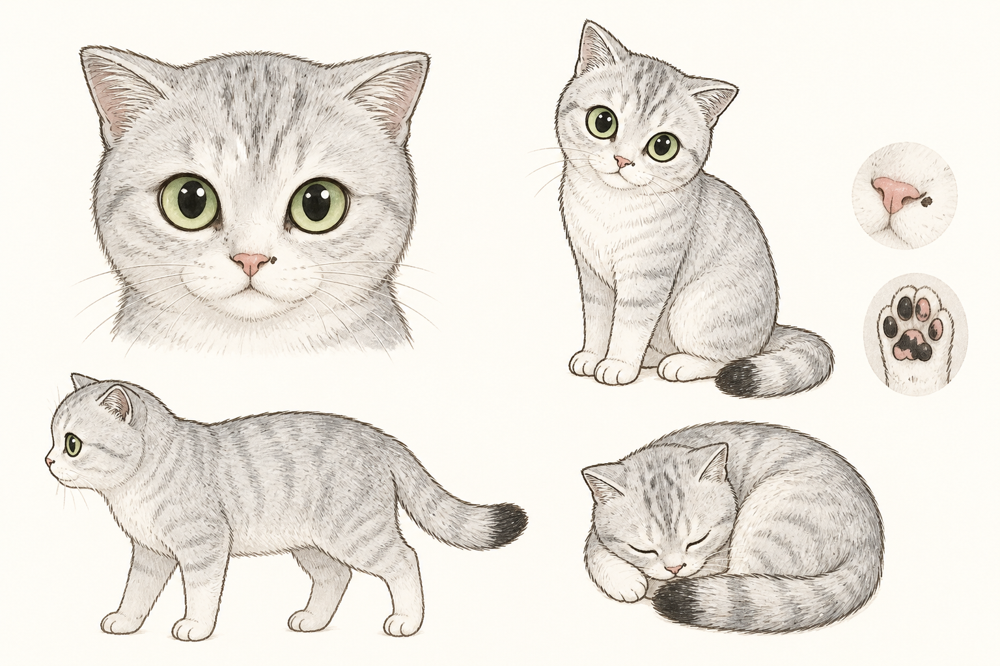

# meow gallery

[中文](README.md) | [English](README.en.md)

> Catch a meow on your phone. Domi blows it back on your desktop.

meow gallery is a desktop pet made from your cat's real sounds. Domi naps, licks a paw, and watches the cursor from a corner. At break time, Domi raises a tiny bubble wand and blows each recording into a bubble you can pop.

It is a quiet rest ritual, not an audio manager or a demanding productivity timer.

[Open the web app](https://domi-meow-gallery.vercel.app/) · [Download the desktop app](https://github.com/wongolivia336-a11y/cat-meow-gallery/releases/latest) · [View releases](https://github.com/wongolivia336-a11y/cat-meow-gallery/releases)



## Three connected products

| Product | Purpose | Distribution |
|---|---|---|
| Mobile app | Record, label, and upload cat sounds | Android APK; iOS via TestFlight / App Store |
| Web app | Zero-install preview, account access, and bubble library | Open in a browser or install as a PWA |
| Desktop pet | Lives on the desktop, schedules breaks, and plays synced recordings | Windows portable ZIP; macOS DMG |

All three use the same email account. Supabase Auth handles email verification codes, private Storage keeps audio files, and Postgres RLS isolates every user's recordings and settings. Recordings save locally first and sync when a connection is available.

The interface supports Chinese and English from the language button in the top-right corner. The Electron tray menu has the same language setting.

## The core rule

There are no preset or duplicated bubbles. One real recording always creates exactly one desktop bubble. A small collection produces larger bubbles; larger collections use smaller bubbles. This makes the screen reflect what the user has actually collected.

## Run locally

Web:

```bash
python devserver.py 8765
```

Desktop pet:

```bash
npm install
npm run pet
```

- Drag Domi anywhere with the left mouse button.
- Right-click Domi to open the same settings as the tray icon.
- Press Esc to return to click-through mode.
- Quit from the tray menu; relaunch from the desktop or Start menu shortcut.

## Downloads and signing

The website exposes stable download routes for Windows, Apple-silicon Mac, Intel Mac, and Android. A `v*` tag triggers GitHub Actions to build release artifacts.

Windows and macOS test builds are currently unsigned, so the operating system may show an unknown-publisher warning. iOS builds require an Apple Developer account, certificates, a provisioning profile, and TestFlight/App Store distribution.

## Project structure

```text
index.html      Page structure and doodle filters
styles.css      Doodle UI and responsive capture/ambient modes
bubbles.js      Bubble physics, rendering, and interactions
domi.js         Bitmap Domi poses, idle/showtime state machine, free dragging
app.js          Recording, playback, storage, UI, and product logic
i18n.js         Chinese/English strings shared by web, mobile, and desktop UI
cloud.js        Supabase authentication and private cloud sync
electron/       Desktop-pet main process and secure preload bridge
android/ ios/   Capacitor native projects
```

## Technology

- Vanilla JavaScript with no web build step
- Matter.js for 2D physics
- rough.js for pre-rendered doodle shapes
- IndexedDB for audio blobs and localStorage for metadata/settings
- Supabase Auth, Storage, Postgres, and RLS for private cross-device sync
- Electron 43 for the desktop pet
- Capacitor for Android and iOS native containers

## Next

- [ ] Sign and distribute the iOS build through TestFlight
- [ ] Add production code signing and notarization for desktop releases
- [ ] Expand Domi's intentionally clumsy hand-drawn pose and transition library

More product notes: [PRODUCT_NOTES.md](PRODUCT_NOTES.md). The next-session checklist is in [TODO.md](TODO.md).
